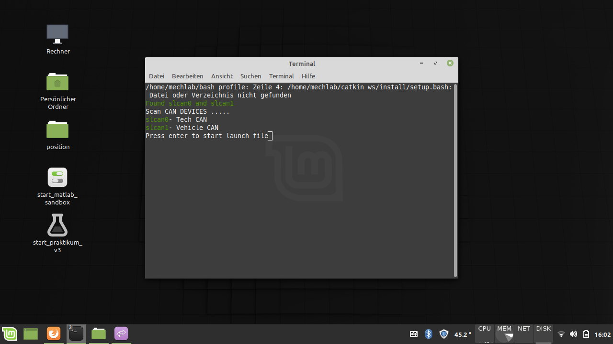
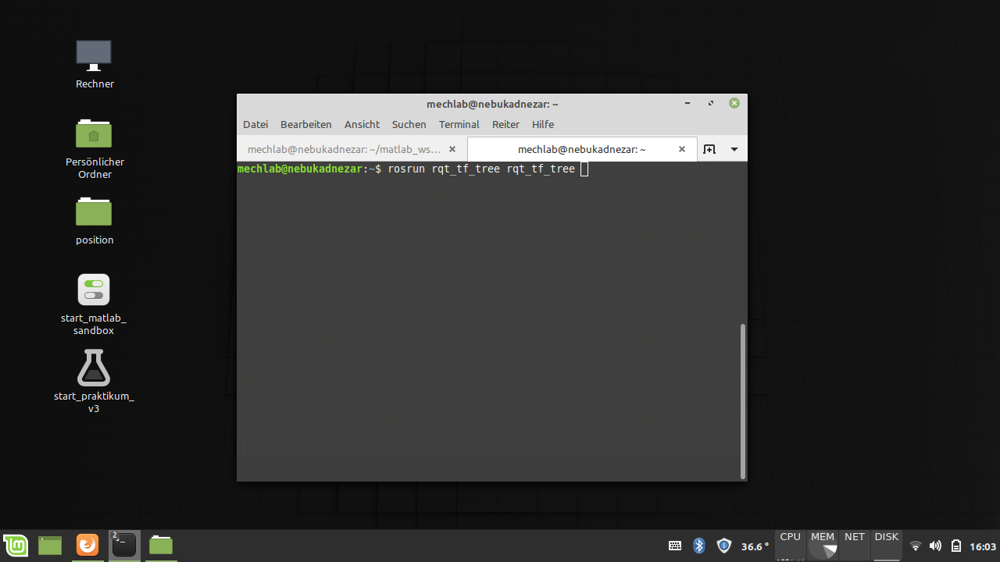
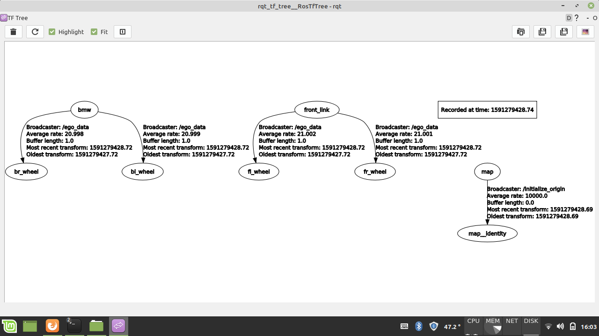
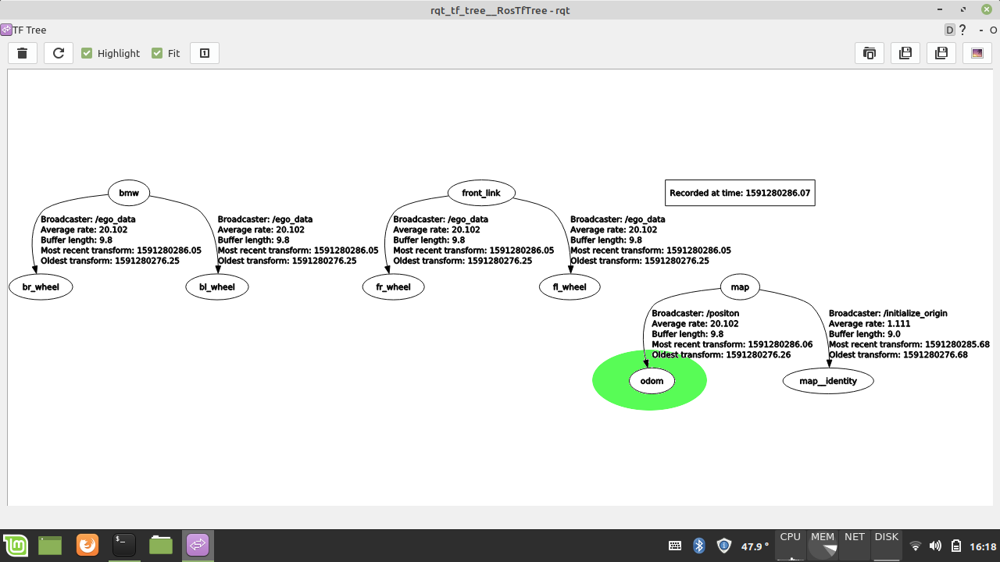

### Vorbereitung techI3 für Anwendungen mit Matlab Simulink

#### Hochfahren des Systems
- Kippschalter im Kofferraum aktivieren
- "Nebukadnezar" (Rechenmaschine) über den scharzen Power Button einschalten
- Fahrzeug aktivieren (CAN-Bus muss )
- Netzwerkleitung mit Matlab-Rechner verbinden
#### ROS Umgebung aktivieren
- Doppelklick auf das Icon "start_matlab_sandbox"



#### Position Paket initialisieren
- Fahrzeug in Bewegung setzen

#### Initialisierung überprüfen

- Graphische Übersicht der `tf-frames` öffnen. Hierfür Terminal über die Testenkombination Strg+Alt+T öffnen und folgendes Kommando eingeben
```console
rosrun rqt_tf_tree rqt_tf_tree
```


- Folgende Übersicht öffnet sich. Solange Initialisierung noch nicht abgeschlossen ist -> `odom` nicht aufgelistet



- Übersicht wenn Initialisierung abgeschlossen ist -> `odom` aufgelistet



